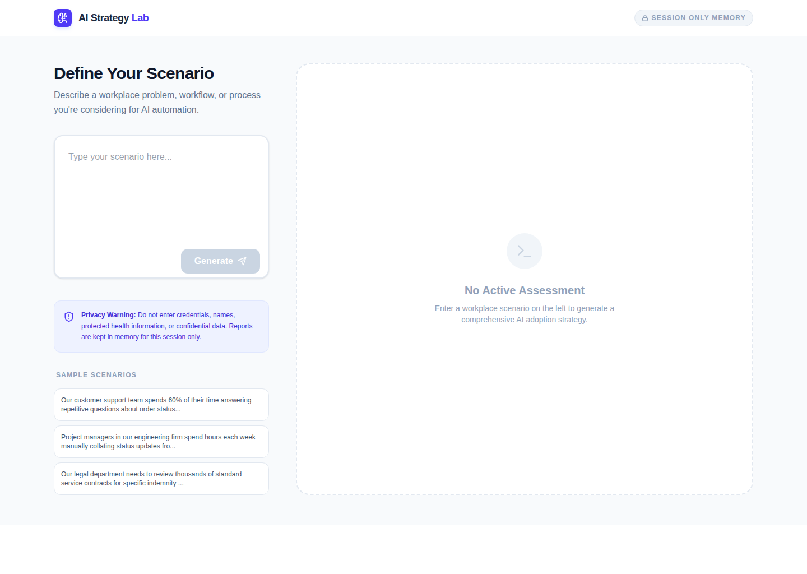

# PilotCraft

[](https://github.com/Hereforlolz/PilotCraft/actions/workflows/ci.yml)
[](./LICENSE)

PilotCraft turns a plain-language description of a workplace problem into a
structured, evidence-checked assessment of whether — and how — to pilot AI
on it, rather than a "yes, use AI" recommendation.

## The problem it addresses

Teams considering AI adoption often skip straight to "let's build an AI
feature" without separating what they actually know from what they're
assuming, without a plan for how to un-adopt it if it doesn't work, and
without deciding up front what would count as success or failure. PilotCraft
is a structured way to think through that decision *before* committing
engineering time to it.

## Who it's for

Built as a personal tool for evaluating and learning about AI-adoption
decisions — useful to anyone (an individual, a small team, a consultant)
who wants a structured first pass at "is this workflow actually a good
candidate for AI?" before proposing a pilot. It is a decision-support aid,
not a substitute for talking to the people who do the work.

## What you enter

A free-text description of a workplace problem, workflow, or process (up to
4,000 characters) — for example, "our support team spends 60% of its time
answering repetitive order-status questions."

**Do not enter names, credentials, health information, or other confidential
or sensitive data.** The scenario text is sent to Google's Gemini API to
generate the report — see [Privacy and data handling](#privacy-and-data-handling)
below.

## What the report produces

A single structured report, rendered as one page, with:

- **Problem statement** — the model's restatement of the scenario
- **Clarifying questions** — what it would need to know to be more confident
- **AI suitability** — a `strong` / `conditional` / `poor` rating with rationale
- **Future workflow** — the proposed step-by-step process
- **Human/AI responsibility split** — what stays with people vs. what the AI handles
- **Stakeholder impact** — who is affected and how
- **Adoption barriers** — likely resistance points and mitigations
- **Training & communication plan** — what people need to be told or taught
- **Risks** — each with a severity, a safeguard, and a required human-review step
- **Pilot plan** — phased actions, an owner, and evidence to collect per phase
- **Success metrics** — each with a baseline, target, and collection method
- **Decision criteria** — explicit stop / revise / scale conditions
- **Evidence check** — user-provided facts vs. assumptions vs. missing evidence
- **Readiness score** — a 0–100 planning heuristic (see below), with the
  specific factors that reduced it

Any generated report can be exported as a Markdown file (client-side, no
server round-trip) or printed / saved as a PDF via the browser's native
print dialog — both buttons sit next to Regenerate above the report.

### Why the tool is allowed to recommend against AI

The model's system prompt explicitly instructs it to weigh non-AI
alternatives (better documentation, a process change, an existing tool)
before recommending AI, and to let that pull the suitability rating toward
`conditional` or `poor` rather than defaulting to `strong`. A report that
always says "yes, use AI" would not be useful — see
[`server.ts`](./server.ts) for the exact system instruction.

### Evidence discipline

The report is required to separate three things instead of blending them
into a single confident narrative:

- **User-provided facts** — only what was actually stated in the scenario
- **Assumptions** — anything the model inferred to fill a gap
- **Missing evidence** — concrete information that would be needed to
  validate the plan but wasn't given (e.g. current error rate, ticket
  volume, headcount)

The system prompt also instructs the model not to fabricate baseline
numbers: if no baseline was given, the report should say so explicitly
(e.g. "not provided — to be measured in pilot") rather than inventing a
plausible-looking figure.

### Readiness score is a heuristic, not a measurement

The UI labels it explicitly: **"Planning heuristic — not an objective
measurement."** It is Gemini's own confidence estimate given the evidence in
the scenario, not a statistically validated score. Two runs of the same
scenario can produce different numbers.

See [`examples/customer-support-triage.md`](./examples/customer-support-triage.md)
for a full worked walkthrough of a report's structure, including a section
on what a human should *not* accept blindly from it.

## Architecture

- **Frontend:** React 19 + Vite 6, Tailwind CSS 4, `lucide-react` icons,
  `motion` for transitions. Streams the response via Server-Sent Events so
  the UI can show live status ("Analyzing scenario with primary engine...",
  "Trying the backup model...") while waiting.
- **Backend:** a single Express 5 server (`server.ts`) that also serves the
  Vite dev middleware in development and static built assets in production
  — there is no separate API host.
- **Model calls:** `@google/genai`, calling Gemini with a JSON
  `responseSchema` for structured output. Current configuration
  (`app.ts`):
  - Primary model: `gemini-3.8-flash`
  - Fallback model: `gemini-3.1-flash-lite`, tried automatically if the
    primary fails with a retryable error (429/500/502/503/504, a timeout,
    or a schema-validation failure that survives one repair attempt) — after
    a 1-second delay to let transient capacity spikes settle, with the
    client-disconnect check re-run after that delay so a client that left
    during it doesn't still get a wasted fallback call
  - Per-attempt timeout: 25 seconds; overall request timeout: 55 seconds
- **Output validation:** the parsed JSON response is validated at runtime
  against a Zod schema (`validation.ts`) — not just guided by the Gemini
  schema, actually checked (enum values, `readinessScore.score` in 0–100,
  required fields present). On a validation or JSON-parse failure, the
  server asks Gemini once to correct its own output before falling back to
  the secondary model.
- **Abuse protection:** a per-IP in-memory rate limiter (8 requests per 15
  minutes) and a 4,000-character scenario cap, since the app has no
  authentication and is meant to be reachable publicly.
- **No database, no persistence layer.** Reports exist only in the
  browser's React state for the current page session.

## Local setup

```bash
git clone https://github.com/Hereforlolz/PilotCraft.git
cd PilotCraft
npm install
cp .env.example .env
# edit .env and set GEMINI_API_KEY to a real Gemini API key
npm run dev
```

This starts the Express server (with Vite's dev middleware) on
`http://localhost:3000`.

For a production build:

```bash
npm run build
npm start
```

## Testing

```bash
npm run lint   # tsc --noEmit
npm test       # node --import tsx --test tests/*.test.ts
npm run build  # vite build + esbuild bundle of server.ts
```

`npm test` runs **35 tests, all passing**, covering:

- the retry/fallback orchestration (a client disconnect must not trigger a
  pointless fallback model call; a genuine timeout still falls back
  normally)
- the JSON-repair flow (malformed JSON or a schema-invalid response
  triggers exactly one repair attempt, not an infinite loop)
- the Zod schema's boundaries (e.g. `readinessScore.score` outside 0–100 is
  rejected)
- which HTTP status codes are treated as retryable
- the real Express route end-to-end (`tests/app.test.ts`, via `createApp()`
  on an ephemeral port): a missing or wrongly-typed request body returns a
  clean 400 instead of crashing, oversized scenarios are rejected, a valid
  request streams a result, and the per-IP rate limit returns 429
- the Markdown export (`src/reportToMarkdown.ts`) covers every report
  section and carries over real field content rather than placeholders

CI also runs a smoke test against the actual built production server
(`.github/workflows/ci.yml`) - hitting the homepage, an unmatched deep
route (guards the Express 5 wildcard-route regression), and an invalid
`/api/analyze` request (guards the request-body regression) - since both
of those bugs lived specifically in the `NODE_ENV=production` code path
that neither `npm run dev` nor the unit tests exercise.

These commands run automatically on every push and pull request to
`main` via GitHub Actions (`.github/workflows/ci.yml`).

## Privacy and data handling

- Scenario text you type **is sent to Google's Gemini API** to generate the
  report. It is not sandboxed or processed locally.
- The server does not persist scenarios or reports anywhere — no database,
  no file writes, no logging of scenario content. Reports live only in the
  browser tab's memory for that session; refreshing the page loses them.
- The server does keep a small in-memory log of which model succeeded or
  failed per request (for its own retry logic), capped at 200 entries and
  never exposed to the client — it does not include scenario text.
- What Gemini itself does with submitted content is governed by Google's
  own API terms, not by this project.

## Honest limitations

- **Not production-hardened.** There is no authentication, no user
  accounts, and no audit log beyond the in-memory model-usage counter
  described above.
- **Not validated in a real organization.** No pilot run through this tool
  has been tracked to a real outcome; the reports are a structured
  starting point for a human decision, not a proven methodology.
- **Not an objective scoring system.** The readiness score is a model
  heuristic, explicitly labeled as such in the UI.
- **Not accessibility-audited.** No WCAG conformance testing has been done;
  earlier drafts of this project claimed WCAG 2.2 AA compliance without
  ever having tested it — that claim has been removed, not fixed by an
  audit.
- **No compliance claims.** This project makes no HIPAA, SOC 2, or similar
  claims, and is not built to handle regulated or sensitive data — the UI
  actively warns users not to enter any.
- **Rate limiting is basic.** The per-IP in-memory limiter resets if the
  server restarts and won't survive running multiple server instances
  behind a load balancer without a shared store.
- **Dependency advisory resolved.** An earlier version of this project ran
  Express 4, which transitively pulled a vulnerable `qs`/`body-parser`
  range (moderate severity, and low actual exposure here since the app
  never parses query-string arrays). The project now runs Express 5,
  which resolves a patched `qs` version.

## Screenshot



The input screen, captured from a locally running build. There is no
screenshot of a generated report here: doing so honestly requires a live
Gemini API call, and one wasn't available when this was written. There is
currently no public deployment of this app — no live-demo link is included
because none exists to link to.

## AI-assistance disclosure

This project's code, its security and reliability fixes, its test suite,
and this README were built with AI coding assistance (Claude Code),
directed and reviewed by the repository owner across several rounds of
review. This disclosure is included so anyone evaluating this project —
including as a portfolio piece — has an accurate picture of how it was
built.

## License

[MIT](./LICENSE) — permissive, no warranty. You can use, copy, modify, and
distribute this code, including commercially, as long as the copyright
notice is preserved.
